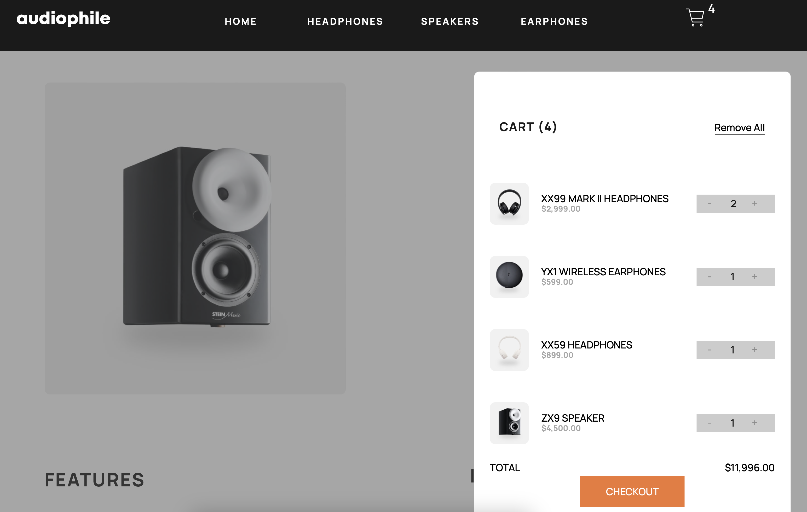
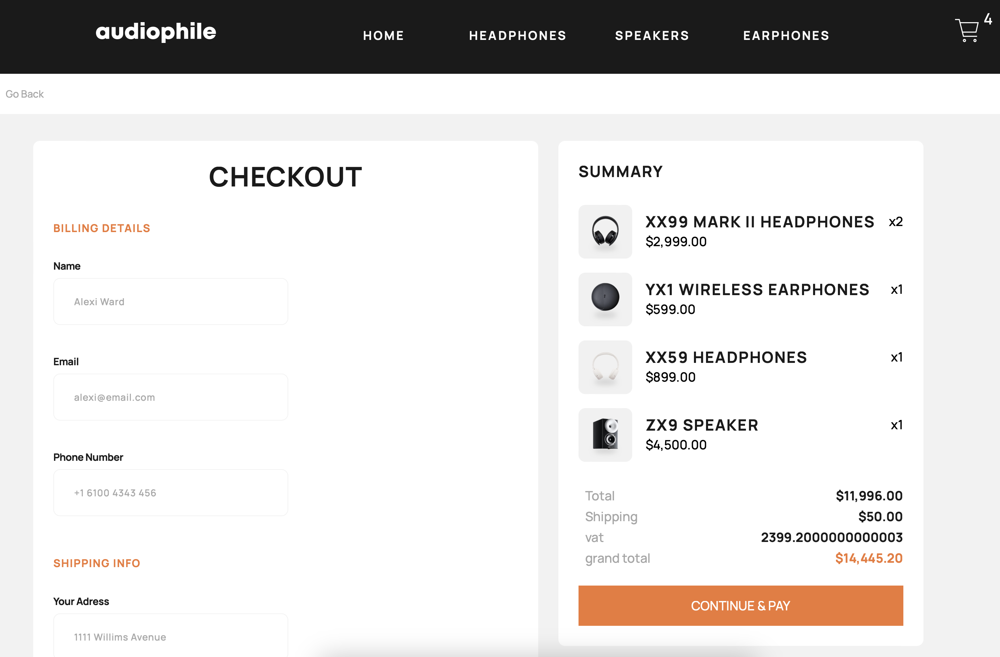

# Frontend Mentor - Audiophile e-commerce website solution

This is a solution to the
[Audiophile e-commerce website challenge on Frontend Mentor](https://www.frontendmentor.io/challenges/audiophile-ecommerce-website-C8cuSd_wx).
Frontend Mentor challenges help you improve your coding skills by building
realistic projects.

## Table of contents

- [Overview](#overview)
  - [The challenge](#the-challenge)
  - [Screenshot](#screenshot)
  - [Links](#links)
- [My process](#my-process)
  - [Built with](#built-with)
  - [What I learned](#what-i-learned)
  - [Continued development](#continued-development)
  - [Useful resources](#useful-resources)
- [Author](#author)
- [Acknowledgments](#acknowledgments)

## Overview

Following project is a Fullstack project. It was obtained from Frontend Mentors.
However it was only a design challange, I have integrated MongoDB, in order to
practise data-base related functionality.

### The challenge

Users can perform folowing actions:

- View the optimal layout for the app depending on their device's screen size
- See hover states for all interactive elements on the page
- Add/Remove products from the cart
- Edit product quantities in the cart
- Fill in all fields in the checkout
- Receive form validations if fields are missed or incorrect during checkout
- See correct checkout totals depending on the products in the cart
  - Shipping always adds $50 to the order
  - VAT is calculated as 20% of the product total, excluding shipping
- See an order confirmation modal after checking out with an order summary
- even after refreshing the browser cart items are tracked.

### Screenshot

 &nbsp;  &nbsp; 

### Links

- Solution URL:
  (https://github.com/Ashraf0011/audiophile.git)
- Live Site URL:
  (https://fluffy-kashata-6ab478.netlify.app)

## My process

I have started this project by doing a component library at the begenning. Which
made it easier to complete rest of the work. Once Component library was done, I
created the pages and called those components inside the page where necessary. I
have separated data contex and Order context in order to have better access and
thus loaded only what I needed. Not only context, I have used local storage to
reduce network calls, if revisited the website.

### Built with

- Semantic HTML5 markup
- CSS custom properties
- Flexbox
- CSS Grid
- Mobile-first workflow
- ForntEnd
  1.  [React](https://reactjs.org/) - JS library
  2.  [SASS](https://sass-lang.com/documentation/) - For styles
- Backend
  1. Node.js
  2. Express.js
  3. MongoDB

### What I learned

some transition property (e.g color) did not effect react-icons. I spent quite
sometime on it. but eventually found that, if i use "fill" instead of color. it
works. just a quick reminder for me:--->

to use transition following values can be used: property duration
timing-function delay

```CSS
.transition{
    transition: <property> <duration> <timing-function> <delay>
}
```

### Continued development

Only form validation is yet to do. I was too exasted to do it right-away. I
wanted to add react memo to this project.

### Useful resources

there awer few resurces I found helpful.

- [Example resource 1](https://www.example.com) - i'll add them later here. I
  really liked this pattern and will use it going forward.

## Author

- Website - [Md Ashraful Islam](https://www.ashrafs.info)
- Frontend Mentor -
  [@Ashraf0011](https://www.frontendmentor.io/profile/Ashraf0011)

## Acknowledgments

My mentor, MD didarul Isalm helped with his inspiration (since this was a big
project for me) and exclusive knowledge at some point.

# Audiophile-Website
